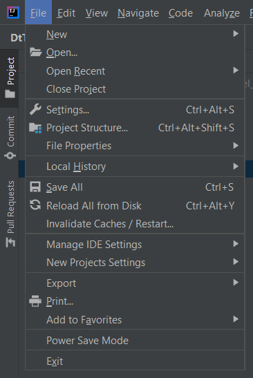
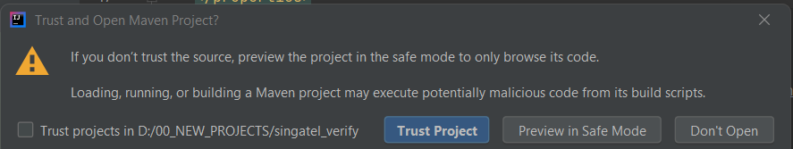
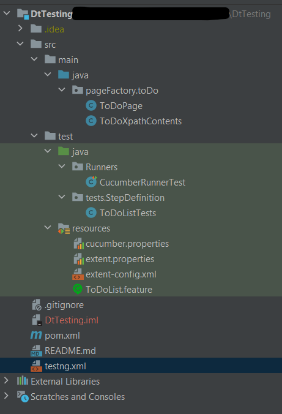
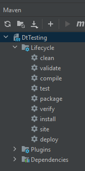
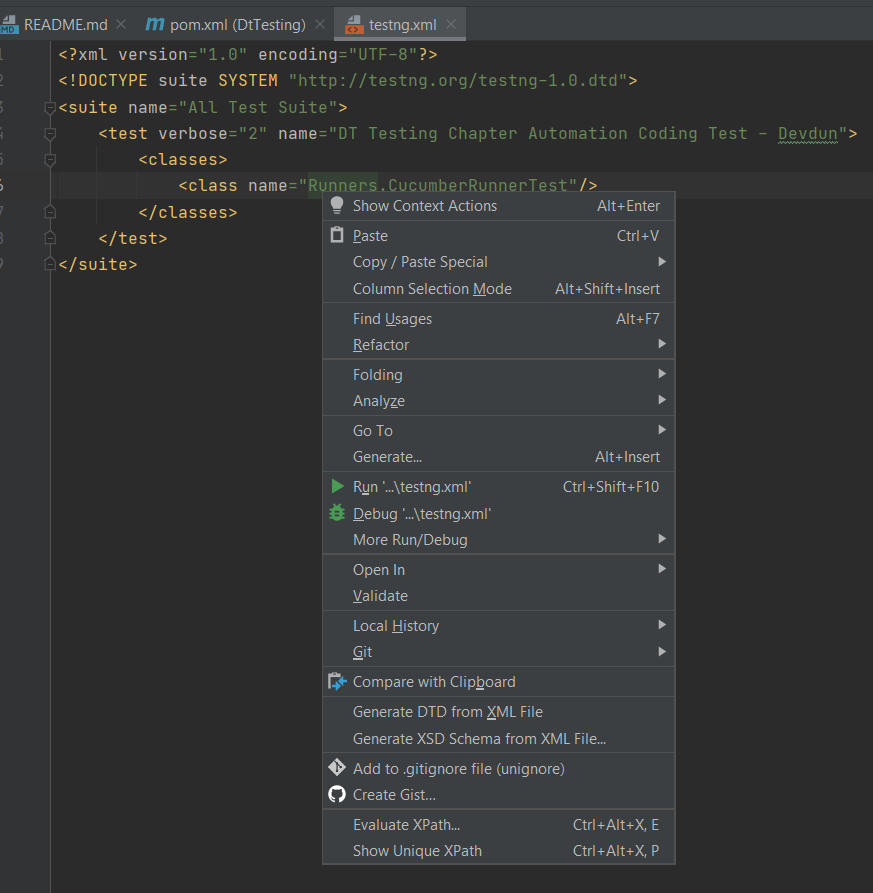

# INTRODUCTION


# Configuration

### Prerequisites

- Git
- IntelliJ idea
- Maven
- JDK

### Setup

-  git clone https://github.com/devdun/DtTesting.git
- Open IntelliJ idea
- Open project




- There will be a popup. Select **Trust Project**

  

- Project structure looks like below image



# HOW TO RUN - STEPS 

>Option One

- Open Project using IntelliJ idea
- Open Lifecycle
- Select test (for more information refer to [Configuration with mvn test command](# Configuration with mvn test command) )




>Option Two

- Open Project using IntelliJ idea

- Navigate to testng.xml

- Run XML file

  
  
  
  
  

>Option Three (ENV Variables should be configured)

- Navigate to the root folder
- Open CMD
- Issue command mvn test (for more information refer to [Configuration with mvn test command](# Configuration with mvn test command) )


# Configuration with mvn test command

```
<plugin>
    <groupId>org.apache.maven.plugins</groupId>
    <artifactId>maven-surefire-plugin</artifactId>
    <version>2.22.2</version>
    <configuration>
        <suiteXmlFiles>
            <suiteXmlFile>testng.xml</suiteXmlFile>
        </suiteXmlFiles>
    </configuration>
</plugin>
```

1. Go to pom.xml
2. You can replace the name "testng.xml" with what you want to execute when you issue the mvn test command 

# Reports


After executing tests there will be two types of reports will generate under `Root/Reports/` folder


> Html report

1. Navigate to the report folder and select folder `html_Pdf_Reports d-MMM-YY HH-mm-ss` (`d-MMM-YY HH-mm-ss` will be the execution timestamp )
2. Select folder name **SparkReport**
3. View **Spark.html** file


> Pdf Report

1. Navigate to the report folder and select folder `html_Pdf_Reports d-MMM-YY HH-mm-ss` (`d-MMM-YY HH-mm-ss` will be the execution timestamp )
2. Select folder name **PdfReport**
3. View **ExtentPdf.pdf** file


# Authors

- Devdun Kariyawasam: devdun90@gmail.com 